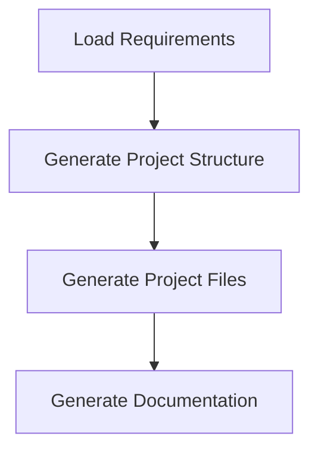

# SRS to FastAPI Project

This project builds an AI-powered backend assistant that analyzes Software Requirements Specification (SRS) documents and generates a FastAPI-based backend system. It leverages LangGraph for workflow orchestration, LangChain for LLM integration, and modern software engineering practices like modularity, testing, and persistence. The project meets multiple milestones, from SRS analysis to autonomous code generation and advanced documentation.

## Current Status

This repository implements:

- **Milestone 1**: Analysis of SRS documents to extract structured requirements (API endpoints, database schema, authentication, business logic) using a LangGraph workflow.
- **Milestone 2**: Generation of a FastAPI project structure with directories and files.
- **Milestone 3**: Autonomous coding of FastAPI routes, SQLAlchemy models, and unit tests.
- **Milestone 6**: Generation of documentation, including an advanced Mermaid diagram visualizing the project generation workflow with dynamic endpoints, sub-nodes, and robust LLM-driven generation.

## Repository Contents

- `.gitignore`: Excludes sensitive files (e.g., `.env`, `venv/`, `generated_project/`).
- `parse_srs.py`: Implements Milestone 1, analyzing SRS documents and generating `requirements.json`.
- `generate_project.py`: Implements Milestones 2, 3, and 6, generating a FastAPI project structure, code, tests, and documentation with an advanced Mermaid diagram.
- `requirements.txt`: Lists Python dependencies for the project.
- `srs/`: Directory for input SRS `.docx` files (e.g., `Python Gen AI SRD backend 14th 18th Apr (1).docx`).
- `outputs/`: Directory for generated `requirements.json`.
- `generated_project/`: Output directory for the FastAPI project, including code, tests, and documentation.

## Setup

Follow these steps to set up the project on Windows:

1. **Clone the Repository**:

   ```bash
   git clone https://github.com/your-username/srs-to-fastapi.git
   cd srs-to-fastapi
   ```

2. **Create and Activate a Virtual Environment**:

   ```bash
   python -m venv venv
   .\venv\Scripts\activate
   ```

3. **Install Dependencies**:

   ```bash
   pip install -r requirements.txt
   ```

   The `requirements.txt` includes:

   - `python-docx==0.8.11`
   - `langchain==0.1.14`
   - `langgraph==0.0.24`
   - `langchain-groq==0.0.1`
   - `pydantic==2.6.4`
   - `python-dotenv==1.0.1`
   - `fastapi==0.110.0`
   - `uvicorn==0.29.0`
   - `sqlalchemy==2.0.25`
   - `psycopg[binary]==3.2.1`
   - `alembic==1.13.1`
   - `python-jose[cryptography]==3.3.0`
   - `passlib[bcrypt]==1.7.4`
   - `pytest==8.1.1`

4. **Set Up Environment Variables**: Create a `.env` file in the project root (`C:\Users\prastripathi\Desktop\srs-to-fastapi`) with your Groq API key:

   ```
   GROQ_API_KEY=your_groq_api_key
   ```

   Obtain the key from Groq.

5. **Install Podman Desktop**: Required for running PostgreSQL containers in the generated project. Download from podman.io and ensure it’s running:

   ```bash
   podman machine start
   ```

## Milestone 1: SRS Analysis

**Objective**: Build an AI workflow using LangGraph to analyze an SRS document and extract structured software requirements.

**Implementation** (`parse_srs.py`):

- **Input**: A `.docx` SRS document (e.g., `srs/Python Gen AI SRD backend 14th 18th Apr (1).docx`).
- **Process**:
  - Reads the SRS document using `python-docx`.
  - Uses a LangGraph workflow with nodes:
    - `read_srs`: Extracts text from the SRS document.
    - `analyze_srs`: Processes text with Llama 3 (via `langchain-groq`) to extract:
      - API endpoints (method, path, description, parameters, response).
      - Database schema (tables, fields, relationships).
      - Authentication and authorization requirements.
      - Business logic.
    - `save_requirements`: Saves extracted requirements as `requirements.json` in the `outputs/` directory.
- **Output**: A JSON file (`outputs/requirements.json`) with structured requirements.
- **Technologies**:
  - LangGraph for workflow orchestration.
  - LangChain with Groq’s Llama 3 (70B) for LLM-driven analysis.
  - Pydantic for structured data validation.

**Usage**:

1. Place the SRS `.docx` file in the `srs/` directory.

2. Run the script:

   ```bash
   python parse_srs.py
   ```

3. Check the output in `outputs/requirements.json`.

**Example Output** (`requirements.json`):

```json
{
  "endpoints": [
    {
      "method": "GET",
      "path": "/users",
      "description": "Retrieve all users",
      "parameters": {},
      "response": {"type": "array", "items": {"type": "object"}}
    },
    {
      "method": "POST",
      "path": "/leaves",
      "description": "Create a leave request",
      "parameters": {"user_id": "integer", "start_date": "date"},
      "response": {"type": "object"}
    },
    {
      "method": "GET",
      "path": "/pods",
      "description": "Retrieve all pods",
      "parameters": {},
      "response": {"type": "array", "items": {"type": "object"}}
    },
    {
      "method": "POST",
      "path": "/pod-members",
      "description": "Add a user to a pod",
      "parameters": {"pod_id": "integer", "user_id": "integer"},
      "response": {"type": "object"}
    }
  ],
  "database_schema": [
    {
      "name": "users",
      "fields": [
        {"name": "id", "type": "Integer", "constraints": "primary_key"},
        {"name": "email", "type": "String", "constraints": "unique"}
      ],
      "relationships": []
    },
    {
      "name": "leaves",
      "fields": [
        {"name": "id", "type": "Integer", "constraints": "primary_key"},
        {"name": "user_id", "type": "Integer", "constraints": "foreign_key"}
      ],
      "relationships": [{"table": "users", "field": "id"}]
    }
  ],
  "auth_requirements": "JWT authentication",
  "business_logic": "Users can create and manage leave requests; pods organize users"
}
```

## Milestone 2: FastAPI Project Structure

**Objective**: Generate a structured FastAPI project with directories and files ready for code generation.

**Implementation** (`generate_project.py`):

- **Input**: `requirements.json` from Milestone 1.
- **Process**:
  - Uses a LangGraph workflow node (`generate_project_structure`) to create:
    - `app/`: Application code (`api/routes/`, `models/`, `services/`, `database.py`, `main.py`).
    - `tests/`: Unit test files.
    - `migrations/`: Alembic migration scripts.
    - Configuration files (`podman-compose.yml`, `.env`, `requirements.txt`).
    - Documentation files (`README.md`, `api_docs.md`, `workflow.mmd`).
- **Output**: A `generated_project/` directory with a complete FastAPI project structure.
- **Technologies**:
  - LangGraph for workflow orchestration.
  - Python for file and directory creation.

**Usage**:

1. Ensure `outputs/requirements.json` exists (run `parse_srs.py`).

2. Run the script:

   ```bash
   python generate_project.py
   ```

3. Check the `generated_project/` directory for the project structure.

## Milestone 3: Autonomous Coding with Unit Tests

**Objective**: Autonomously generate FastAPI routes, SQLAlchemy models, configurations, and unit tests based on requirements.

**Implementation** (`generate_project.py`):

- **Input**: `requirements.json` and project structure from Milestone 2.
- **Process**:
  - Uses a LangGraph workflow node (`generate_project_files`) to:
    - Generate FastAPI routes (`app/api/routes/*.py`) for endpoints (e.g., `/users`, `/leaves`).
    - Create SQLAlchemy models (`app/models/*.py`) for database tables (e.g., `users`, `leaves`).
    - Produce configuration files (`podman-compose.yml` for PostgreSQL, `.env`, `requirements.txt`).
    - Generate unit tests (`tests/test_*.py`) for API endpoints using `pytest`.
  - Integrates with `database.py` for SQLAlchemy session management and `main.py` for FastAPI app setup.
- **Output**: A fully functional FastAPI project with code and tests in `generated_project/`.
- **Technologies**:
  - FastAPI for API development.
  - SQLAlchemy for ORM.
  - Pytest for unit testing.
  - Podman for containerized PostgreSQL.

**Usage**:

1. Run `generate_project.py` (as above).

2. Navigate to `generated_project/`:

   ```bash
   cd generated_project
   ```

3. Run tests:

   ```bash
   pytest
   ```

4. Start the FastAPI server:

   ```bash
   .\venv\Scripts\activate
   podman-compose up -d
   alembic upgrade head
   uvicorn app.main:app --host 0.0.0.0 --port 8000
   ```

5. Access the API at http://localhost:8000/docs.

## Milestone 6: Documentation with Mermaid Diagrams

**Objective**: Generate comprehensive documentation, including a Mermaid diagram visualizing the LangGraph workflow.

**Implementation** (`generate_project.py`):

- **Input**: `requirements.json` and project files from Milestones 2 and 3.
- **Process**:
  - Uses a LangGraph workflow node (`generate_documentation`) to create:
    - `README.md`: Project overview, setup, and usage instructions.
    - `api_docs.md`: Detailed API endpoint documentation.
    - `workflow.mmd`: Advanced Mermaid diagram visualizing the workflow.
  - The `workflow.mmd` is generated using Llama 3 with retry logic (up to 3 attempts) and includes:
    - **Dynamic Endpoints**: Reflects API paths (e.g., `/users, /leaves, /pods, /pod-members`) from `requirements.json`.
    - **Sub-Nodes**: Details sub-tasks under “Generate Project Files” (e.g., Generate Models, Routes, Configs).
    - **Clickable Nodes**: Interactive links (e.g., `click A href "#load-requirements"`) for documentation viewers.
    - **Styled Error Path**: Visualizes errors (e.g., missing `requirements.json`) with dashed lines.
    - **Advanced Styling**: Uses distinct colors (e.g., `#f9f`, `#bbf`) and stroke styles for clarity.
- **Output**: Documentation files in `generated_project/`.
- **Technologies**:
  - LangChain with Groq’s Llama 3 (70B) for LLM-driven documentation.
  - Mermaid for workflow visualization.

**Usage**:

1. Run `generate_project.py` (as above).

2. View documentation in `generated_project/`:

   - Open `README.md` and `api_docs.md` in a Markdown viewer.
   - Open `workflow.mmd` in Mermaid Live Editor or GitHub to visualize the workflow.

**Example Mermaid Diagram** (`workflow.mmd`):



## Future Milestones

- **Milestone 4**: Persistence and iterative improvements.
- **Milestone 5**: Deployment via zip archive.
- **Milestone 7**: LangSmith logging.
- **Milestone 8**: FastAPI endpoint for SRS input.

## Contributing

Contributions are welcome! Please open an issue or submit a pull request on GitHub.

## License

MIT License